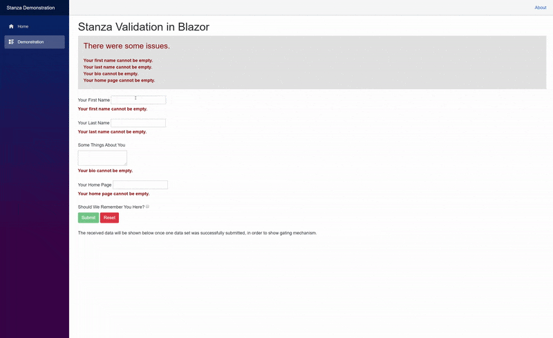

# Stanza Validation Engine

Stanza is a validation engine library written in C# 8, targeting .NET Standard 2.1. It aims to make validating data easy, even when used in non-trivial situations, without being very verbose, while making it easy to combine and customize rule sets. It is an exploration of an alternate design to [Strikeout](https://github.com/Yeet-Labs/Strikeout), where the rule set is purely an evaluation unit that can be combined and layered in arbitrary ways with other units.

## Usage

### Basic Example

The following code details defining a `Validation`, which is an arbitrary set of validation rules, for determning whether a user's requested handle is valid. It uses a handful of reusable defined helper components to do this without being overly verbose. Duplicate nodes embedded in validations should be optimized away by the execution pipeline, so it's better to double check assumptions like nullness, because it comes at no extra cost.

```csharp
static Validator<string> DataPresent { get; } = value => value switch
{
    null => "{0} is required.",
    "" => "{0} cannot be empty.",
    { } when String.IsNullOrWhiteSpace(value) => "{0} cannot be blank.",
    _ => true
};

static Builder<string, (int Target, bool Minimum)> Length { get; } = length => new Validation<string>(consecutive: true)
{
    DataPresent,
    value => (length.Minimum, value!) switch
    {
        (true, { }) when value.Length < length.Target => $"{{0}} is only {value.Length} characters long, but must be at least {length.Target}.",
        (false, { }) when value.Length > length.Target => $"{{0}} is {value.Length} characters long, must be less than or equal to {length.Target}.",
        _ => true
    }
};

static Generator<string, Range> Range { get; } = range => value => new Validation<string>(consecutive: true)
{
    DataPresent,
    Length((range.Start.Value, Minimum: true)),
    Length((range.End.Value, false))
};

static Validation<string> Handle { get; } = new Validation<string>(consecutive: true)
{
    DataPresent, // Checks that the data is not null or empty.
    Range(3..10), // Checks that the value contains between 3 and 10 characters.
    value => value switch
    {
        "admin" => @"{0} cannot be reserved word ""admin"".",
        "moderator" => @"{0} cannot be reserved word "moderator", but you can apply to be a moderator at example.com/apply.",
        _ => true // This can return another validator or validation containing more rules if layering is needed.
    }
}
```

#### Execution

These definitions can be used in a number of ways, but the simplest is calling `Validation<T>.Execute`, then optionally calling the extension method `GetFormattedEvaluations` on the result, providing an identifier, if templated strings are used and you wish to populate the placeholders.

```csharp
foreach (Evaluation evaluation in Handle.Execute("Blah").GetFormattedEvaluations("Your handle"))
{
    // TODO: Do something with the evaluation.
}
```

You can also store the generated optimized `Evaluator` for later use if the `Validation` instance will not change, which is usually the case. These `Evaluator` instances are meant to be as fast as possible to run multiple times, using a closure to store a result cache.

```csharp
Evaluator<string> handleValidator = Handle.BuildEvaluator();

handleValidator.Invoke("Blah");
handleValidator.Invoke("Second Handle");
```

### Simple Blazor Example

Stanza.Blazor contains a number of utilities to easily use Stanza in Blazor, such as `EvaluationView` for displaying `Evaluation`s emitted by rule set executions, and a gating mechanism which can not only summarize the results but also aggregate them, so that it can easily be determined whether validation for a set of data has succeeded, failed, or something else.

```razor
<Gate Data="@((First: "", Second: ""))" Context="validator" Summarize ShowResultsAsHeader>
    <label for="first-handle-input">Your Primary Handle</label>
    <input id="first-handle-input" @bind="validator.Data.First" @bind:event="oninput" type="text" />
    <EvaluationView Data="validator.Data.First" Validations="Handle" Identifier="Your primary handle" />

    <br />

    <label for="last-handle-input">Your Alternate Handle</label>
    <input id="last-handle-input" @bind="validator.Data.Second" @bind:event="oninput" type="text" />
    <EvaluationView Data="validator.Data.Second" Validations="Handle" Identifier="Your alternate handle" />

    <br />

    <button type="submit" class="btn btn-success" disabled="@validator.FailedValidation" @onclick="() => /* Do something with validator.Data. */">Submit</button>
    <button type="reset" class="btn btn-danger">Reset</button>
</Gate>
```

## Demonstration



## Contributions

This project welcomes and appreciates contributions.

## License

This project and it's source is provided under the [MIT license](LICENSE.txt).